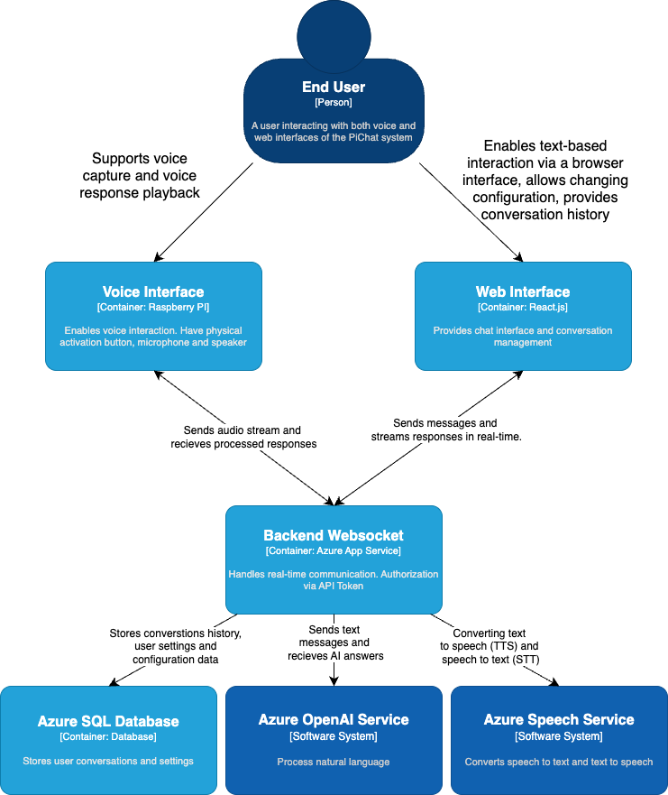

# PiChat: AI Assistant with Raspberry Pi and Azure

> **Note**: Polish version of this documentation is available in [README_PL.md](README_PL.md)

## Table of Contents

1. [Project Overview](#project-overview)
2. [System Architecture](#system-architecture)
3. [System Components](#system-components)
4. [Web Interface](#web-interface)
5. [Voice Interface](#voice-interface)
6. [Hardware Requirements](#hardware-requirements)
7. [Software Requirements](#software-requirements)
8. [Real-time Communication](#real-time-communication)
9. [Azure Infrastructure](#azure-infrastructure)
10. [Docker Deployment](#docker-deployment)
11. [Cost Calculator](#cost-calculator)
12. [Summary](#summary)

## Project Overview

PiChat is a versatile AI chatbot system that combines the power of Raspberry Pi with Azure cloud services, creating an assistant with a dual interface. The system offers:

1. **Voice Interface**: Voice activation using the phrase "Hey Iris" (configurable) on Raspberry Pi, enabling natural conversation with the AI assistant.
2. **Web Interface**: Access to the same AI capabilities through a responsive web application, providing text conversations and history management.

The system supports Azure OpenAI language models, allows customization of the assistant's personality, and preserves conversation history across both interfaces. All user interactions are stored in Azure Cosmos DB, enabling users to review and continue previous conversations.

## System Architecture

### System Context (C1)

The PiChat system enables user interaction with the AI assistant through a voice interface (Raspberry Pi) and a web interface. The system utilizes Azure cloud services for natural language processing, data storage, and application hosting.

### Containers (C2)

The diagram shows the main components of the PiChat system:
- Raspberry Pi-based voice interface handling voice interactions
- React frontend application offering a text interface
- FastAPI backend with WebSockets for real-time communication
- Azure Cosmos DB for storing application data
- Azure OpenAI Service for natural language processing
- Azure Cognitive Services Speech for speech-to-text and text-to-speech conversion
- Azure IoT Hub for communication with the Raspberry Pi device

## System Components

The PiChat system consists of four main components:

1. **Frontend** - Web application built using:
   - React 18 with TypeScript
   - Vite as the build tool
   - Tailwind CSS for styling
   - WebSockets for real-time communication

2. **Backend** - API server based on:
   - FastAPI with Python
   - WebSockets for real-time communication
   - Integration with Azure Cosmos DB
   - Integration with Azure OpenAI

3. **Raspberry Pi** - Voice client:
   - Wake word detection ("Hey GPT")
   - Integration with Azure Cognitive Services Speech
   - Communication with the backend through Azure IoT Hub

4. **Infrastructure** - Azure resources deployed with Terraform:
   - Azure Cosmos DB (NoSQL database)
   - Azure Cognitive Services Speech
   - Azure OpenAI Service
   - Azure IoT Hub
   - Azure Key Vault

## Web Interface

The PiChat web interface is a modern React application offering convenient access to the AI assistant through a web browser.

### Web Interface Features

- Conversation list with filtering and search options
- Chat panel with message history
- Markdown support in messages
- Dark/light mode
- Responsive design working on mobile and desktop devices

### Web Interface Technologies
- React 18 with TypeScript
- Vite as the build tool
- Tailwind CSS for styling
- React Router for navigation
- WebSockets for real-time communication
- Radix UI for accessibility components

## Voice Interface

The PiChat voice interface runs on Raspberry Pi, offering natural voice interactions with the AI assistant.

### Voice Interface Features
- Voice activation through the phrase "Hey Iris" (configurable)
- Speech recognition using Azure Cognitive Services
- High-quality speech synthesis using Azure neural voices
- Conversation context preservation
- Ability to interrupt responses with the word "Stop conversation"

### Raspberry Pi Client Implementation
- Python program using Azure Speech SDK
- Communication with the backend through Azure IoT Hub
- Configuration through a JSON file
- Support for multiple languages and voices

## Hardware Requirements

### Basic Components

| Component | Minimum Requirements | Recommended Specifications |
|-----------|---------------------|------------------------|
| Single Board Computer | Raspberry Pi 3 Model B | Raspberry Pi 4 Model B (2GB+) |
| MicroSD Card | 16GB, Class 10 | 32GB+, UHS Speed Class 3 |
| Power Supply | 5V/2.5A | 5V/3A, USB-C |
| Case | Basic | With passive cooling |

### Audio Components

| Component | Minimum Requirements | Recommended Specifications |
|-----------|---------------------|------------------------|
| Microphone | USB, unidirectional | USB with noise reduction |
| Speaker | Mini USB speaker | I2S speaker with amplifier |

### Additional Components

| Component | Minimum Requirements | Recommended Specifications |
|-----------|---------------------|------------------------|
| Network Connection | Wi-Fi | Ethernet + Wi-Fi |
| Backup Power | None | UPS HAT or power bank |

## Software Requirements

### Raspberry Pi
- Raspberry Pi OS (Debian Bullseye or newer)
- Python 3.7+
- Azure Speech SDK
- Libraries for IoT Hub

### Backend
- Python 3.8+
- FastAPI 0.110+
- Uvicorn
- Azure Cosmos DB SDK
- Azure IoT Hub SDK
- Docker (optional)

### Frontend
- Node.js 16+
- React 18
- TypeScript
- Vite
- Docker (optional)

### Azure Infrastructure
- Terraform 1.0+
- Azure CLI
- Active Azure subscription

## Real-time Communication

PiChat uses WebSockets for real-time communication between interfaces and the backend:

### Communication Architecture
- **Backend (FastAPI)** - handles WebSockets directly
- **Frontend (React)** - uses native WebSocket API
- **Raspberry Pi** - communicates with the backend through Azure IoT Hub

### WebSocket Message Types
- `GET_CHATS`: Retrieving the list of chats
- `CREATE_CHAT`: Creating a new chat
- `GET_CHAT_HISTORY`: Retrieving message history
- `DELETE_CHAT`: Deleting a chat
- `SEND_MESSAGE`: Sending a message

## Azure Infrastructure

PiChat utilizes the following Azure services:

### Azure Cosmos DB
- NoSQL database storing:
  - Chats
  - Messages
  - Users
  - Settings
  - Processed messages

### Azure Cognitive Services Speech
- Service for speech-to-text and text-to-speech conversion
- Support for multiple languages and voices

### Azure OpenAI Service
- Integration with GPT models for intelligent responses
- Support for various API versions and models

### Azure IoT Hub
- Communication with the Raspberry Pi device
- Connection and telemetry management

### Azure Key Vault
- Secure storage of application keys and secrets

## Docker Deployment

PiChat can be easily deployed using Docker:

### Requirements
- Docker 20.10+
- Docker Compose 2.0+

### Docker Components
- **frontend**: Container with React application
- **backend**: Container with FastAPI

### Deployment Instructions
1. Clone the repository
2. Create an `.env` file with required environment variables
3. Run `docker-compose up -d`
4. Frontend access: http://localhost:8501
5. Backend access: http://localhost:8080

## Cost Calculator

Below are the estimated monthly costs for the PiChat solution:

### Azure Services Cost (monthly)

| Service | Specification | Usage | Cost (EUR) |
|--------|-------------|--------|------------|
| Azure Cosmos DB | Standard | 1 GB of data | €2.50 |
| Azure Cognitive Services Speech | Standard | 5 hours of speech recognition/synthesis daily | €4.20 |
| Azure OpenAI Service | GPT-3.5/GPT-4 | 100 queries daily | €7.50 |
| Azure IoT Hub | F1 | 1 device | free |
| Azure Key Vault | Standard | Standard usage | €0.03 |
| **TOTAL** | | | **€19.23** |

### One-time Hardware

| Component | Cost (EUR) |
|-----------|-------------|
| Raspberry Pi 4 (2GB) | €45.00 |
| MicroSD Card (32GB) | €10.00 |
| USB Microphone | €15.00 |
| Speaker | €12.00 |
| **TOTAL** | **€82.00** |

## Summary

PiChat is a comprehensive AI assistant system combining a voice interface on Raspberry Pi with a modern web application. It utilizes Azure services to provide advanced AI features, data storage, and real-time communication.

The microservices-based architecture, containerization using Docker, and infrastructure as code (Terraform) ensure ease of deployment and maintenance. The system is flexible and can be extended with new features and integrations.

Key advantages of PiChat:
- Dual-mode: access via voice or web interface
- Utilization of the latest AI technologies with Azure OpenAI
- Cloud storage of conversation history
- Easy deployment through containerization
- Infrastructure managed as code
