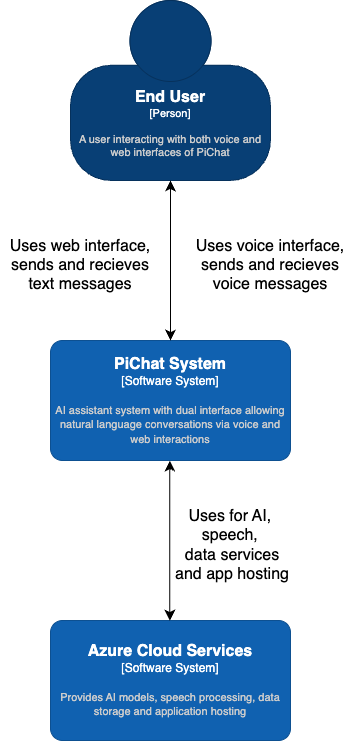
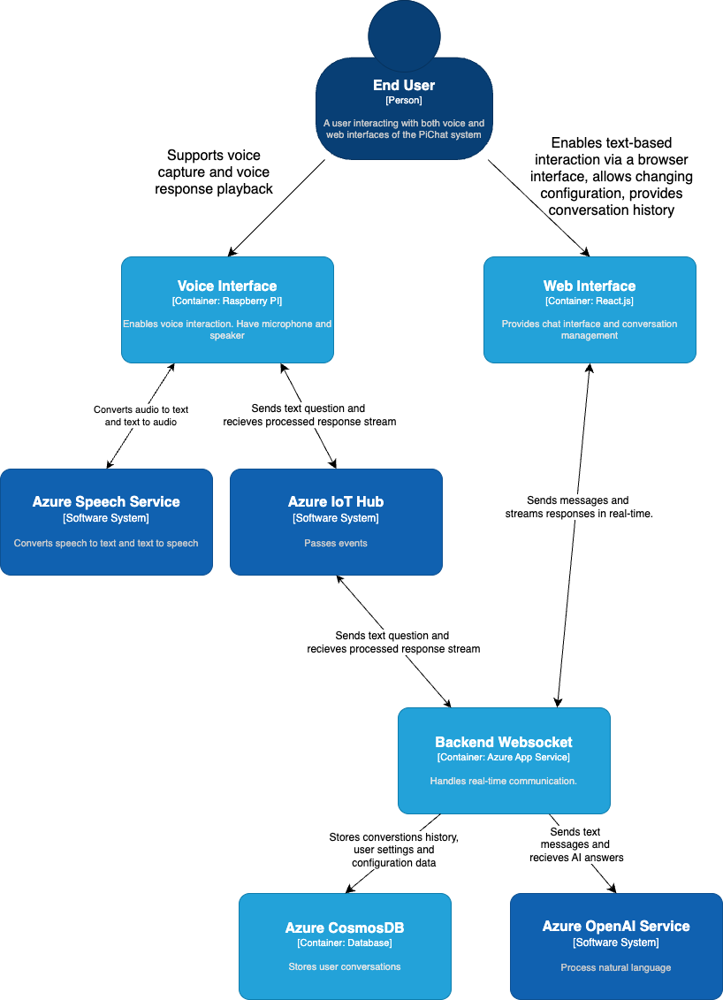

# PiChat: Asystent AI z Raspberry Pi i Azure

## Spis treści

1. [Przegląd projektu](#przegląd-projektu)
2. [Architektura systemu](#architektura-systemu)
3. [Komponenty systemu](#komponenty-systemu)
4. [Interfejs webowy](#interfejs-webowy)
5. [Interfejs głosowy](#interfejs-głosowy)
6. [Wymagania sprzętowe](#wymagania-sprzętowe)
7. [Wymagania programowe](#wymagania-programowe)
8. [Komunikacja w czasie rzeczywistym](#komunikacja-w-czasie-rzeczywistym)
9. [Infrastruktura Azure](#infrastruktura-azure)
10. [Wdrożenie z użyciem Dockera](#wdrożenie-z-użyciem-dockera)
11. [Kalkulator kosztów](#kalkulator-kosztów)
12. [Podsumowanie](#podsumowanie)

## Przegląd projektu

PiChat to wszechstronny system chatbota AI, który łączy moc Raspberry Pi z usługami chmurowymi Azure, tworząc asystenta z podwójnym interfejsem. System oferuje:

1. **Interfejs głosowy**: Aktywacja głosowa za pomocą frazy "Hey GPT" (konfigurowalna) na Raspberry Pi, umożliwiająca naturalną rozmowę z asystentem AI.
2. **Interfejs webowy**: Dostęp do tych samych możliwości AI poprzez responsywną aplikację webową, zapewniającą rozmowy tekstowe i zarządzanie historią.

System obsługuje modele językowe Azure OpenAI, umożliwia personalizację osobowości asystenta oraz zachowuje historię rozmów w obu interfejsach. Wszystkie interakcje użytkownika są przechowywane w Azure Cosmos DB, co umożliwia przeglądanie i kontynuowanie poprzednich rozmów.

## Architektura systemu

### Kontekst systemu (C1)

System PiChat umożliwia interakcję użytkownika z asystentem AI poprzez interfejs głosowy (Raspberry Pi) oraz interfejs webowy. System wykorzystuje usługi chmurowe Azure do przetwarzania języka naturalnego, przechowywania danych i hostowania aplikacji.

### Kontenery (C2)

Diagram pokazuje główne komponenty systemu PiChat:
- Interfejs głosowy oparty o Raspberry Pi obsługujący interakcje głosowe
- Aplikacja frontendowa React oferująca interfejs tekstowy
- Backend oparty o FastAPI z WebSocketami dla komunikacji w czasie rzeczywistym
- Azure Cosmos DB do przechowywania danych aplikacji
- Azure OpenAI Service do przetwarzania języka naturalnego
- Azure Cognitive Services Speech do konwersji głosu na tekst i tekstu na głos
- Azure IoT Hub do komunikacji z urządzeniem Raspberry Pi

## Komponenty systemu

System PiChat składa się z czterech głównych komponentów:

1. **Frontend** - Aplikacja webowa zbudowana z użyciem:
   - React 18 z TypeScript
   - Vite jako narzędzie budujące
   - Tailwind CSS do stylizacji
   - WebSockety do komunikacji w czasie rzeczywistym

2. **Backend** - Serwer API oparty o:
   - FastAPI z Pythona
   - Websockety dla komunikacji w czasie rzeczywistym
   - Integracja z Azure Cosmos DB
   - Integracja z Azure OpenAI

3. **Raspberry Pi** - Klient głosowy:
   - Detekcja słowa aktywacyjnego ("Hey GPT")
   - Integracja z Azure Cognitive Services Speech
   - Komunikacja z backendem przez Azure IoT Hub

4. **Infrastruktura** - Zasoby Azure wdrażane przez Terraform:
   - Azure Cosmos DB (baza NoSQL)
   - Azure Cognitive Services Speech
   - Azure OpenAI Service
   - Azure IoT Hub
   - Azure Key Vault

## Interfejs webowy

Interfejs webowy PiChat to nowoczesna aplikacja React oferująca wygodny dostęp do asystenta AI poprzez przeglądarkę internetową.

### Funkcje interfejsu webowego

- Lista rozmów z opcjami filtrowania i wyszukiwania
- Panel czatu z historią wiadomości
- Wsparcie dla Markdown w wiadomościach
- Tryb ciemny/jasny
- Responsywny design działający na urządzeniach mobilnych i desktopowych

### Technologie interfejsu webowego
- React 18 z TypeScript
- Vite jako narzędzie budujące
- Tailwind CSS do stylizacji
- React Router do nawigacji
- WebSockety do komunikacji w czasie rzeczywistym
- Radix UI dla komponentów dostępności

## Interfejs głosowy

Interfejs głosowy PiChat działa na Raspberry Pi, oferując naturalne interakcje głosowe z asystentem AI.

### Funkcje interfejsu głosowego
- Aktywacja głosowa przez frazę "Hey GPT" (konfigurowalna)
- Rozpoznawanie mowy z wykorzystaniem Azure Cognitive Services
- Synteza mowy wysokiej jakości z użyciem głosów neuralnych Azure
- Zachowanie kontekstu konwersacji
- Możliwość przerwania odpowiedzi słowem "Stop conversation"

### Implementacja klienta Raspberry Pi
- Program w Python wykorzystujący Azure Speech SDK
- Komunikacja z backendem przez Azure IoT Hub
- Konfiguracja przez plik JSON
- Wsparcie dla wielu języków i głosów

## Wymagania sprzętowe

### Komponenty podstawowe

| Komponent | Minimalne wymagania | Zalecane specyfikacje |
|-----------|---------------------|------------------------|
| Komputer jednopłytkowy | Raspberry Pi 3 Model B | Raspberry Pi 4 Model B (2GB+) |
| Karta microSD | 16GB, Class 10 | 32GB+, UHS Speed Class 3 |
| Zasilacz | 5V/2.5A | 5V/3A, USB-C |
| Obudowa | Podstawowa | Z pasywnym chłodzeniem |

### Komponenty audio

| Komponent | Minimalne wymagania | Zalecane specyfikacje |
|-----------|---------------------|------------------------|
| Mikrofon | USB, jednokierunkowy | USB z redukcją szumów |
| Głośnik | Mini głośnik USB | Głośnik I2S z wzmacniaczem |

### Komponenty dodatkowe

| Komponent | Minimalne wymagania | Zalecane specyfikacje |
|-----------|---------------------|------------------------|
| Połączenie sieciowe | Wi-Fi | Ethernet + Wi-Fi |
| Zasilanie awaryjne | Brak | UPS HAT lub powerbank |

## Wymagania programowe

### Raspberry Pi
- Raspberry Pi OS (Debian Bullseye lub nowszy)
- Python 3.7+
- Azure Speech SDK
- Biblioteki dla IoT Hub

### Backend
- Python 3.8+
- FastAPI 0.110+
- Uvicorn
- Azure Cosmos DB SDK
- Azure IoT Hub SDK
- Docker (opcjonalnie)

### Frontend
- Node.js 16+
- React 18
- TypeScript
- Vite
- Docker (opcjonalnie)

### Infrastruktura Azure
- Terraform 1.0+
- Azure CLI
- Aktywna subskrypcja Azure

## Komunikacja w czasie rzeczywistym

PiChat wykorzystuje WebSockety do komunikacji w czasie rzeczywistym między interfejsami i backendem:

### Architektura komunikacji
- **Backend (FastAPI)** - obsługuje WebSockety bezpośrednio
- **Frontend (React)** - używa natywnego WebSocket API
- **Raspberry Pi** - komunikuje się z backendem przez Azure IoT Hub

### Typy komunikatów WebSocket
- `GET_CHATS`: Pobieranie listy czatów
- `CREATE_CHAT`: Tworzenie nowego czatu
- `GET_CHAT_HISTORY`: Pobieranie historii wiadomości
- `DELETE_CHAT`: Usuwanie czatu
- `SEND_MESSAGE`: Wysyłanie wiadomości

## Infrastruktura Azure

PiChat wykorzystuje następujące usługi Azure:

### Azure Cosmos DB
- Baza danych NoSQL przechowująca:
  - Czaty
  - Wiadomości
  - Użytkowników
  - Ustawienia
  - Przetworzone wiadomości

### Azure Cognitive Services Speech
- Usługa do konwersji mowy na tekst i tekstu na mowę
- Obsługa wielu języków i głosów

### Azure OpenAI Service
- Integracja z modelami GPT dla inteligentnych odpowiedzi
- Wsparcie dla różnych wersji API i modeli

### Azure IoT Hub
- Komunikacja z urządzeniem Raspberry Pi
- Zarządzanie połączeniami i telemetrią

### Azure Key Vault
- Bezpieczne przechowywanie kluczy i sekretów aplikacji

## Wdrożenie z użyciem Dockera

PiChat można łatwo wdrożyć za pomocą Dockera:

### Wymagania
- Docker 20.10+
- Docker Compose 2.0+

### Komponenty Dockerowe
- **frontend**: Kontener z aplikacją React
- **backend**: Kontener z FastAPI

### Instrukcja wdrożenia
1. Sklonuj repozytorium
2. Utwórz plik `.env` z wymaganymi zmiennymi środowiskowymi
3. Uruchom `docker-compose up -d`
4. Dostęp do frontendu: http://localhost:8501
5. Dostęp do backendu: http://localhost:8080

## Kalkulator kosztów

Poniżej przedstawiam szacowane koszty miesięczne dla rozwiązania PiChat:

### Koszt usług Azure (miesięcznie)

| Usługa | Specyfikacja | Użycie | Koszt (EUR) |
|--------|-------------|--------|------------|
| Azure Cosmos DB | Standard | 1 GB danych | 2.50 € |
| Azure Cognitive Services Speech | Standard | 5 godz. rozpoznawania/syntezy mowy dziennie | 4.20 € |
| Azure OpenAI Service | GPT-3.5/GPT-4 | 100 zapytań dziennie | 7.50 € |
| Azure IoT Hub | F1 | 1 urządzenie | free € |
| Azure Key Vault | Standard | Standardowe użycie | 0.03 € |
| **SUMA** | | | **19.23 €** |

### Sprzęt jednorazowy

| Komponent | Koszt (EUR) |
|-----------|-------------|
| Raspberry Pi 4 (2GB) | 45.00 € |
| Karta microSD (32GB) | 10.00 € |
| Mikrofon USB | 15.00 € |
| Głośnik | 12.00 € |
| **SUMA** | **82.00 €** |

## Podsumowanie

PiChat to kompleksowy system asystenta AI łączący interfejs głosowy na Raspberry Pi z nowoczesną aplikacją webową. Wykorzystuje usługi Azure do zapewnienia zaawansowanych funkcji AI, przechowywania danych i komunikacji w czasie rzeczywistym.

Architektura oparta o mikrousługi, konteneryzacja z użyciem Dockera i infrastruktura jako kod (Terraform) zapewniają łatwość wdrożenia i utrzymania. System jest elastyczny i można go rozszerzać o nowe funkcje i integracje.

Główne zalety PiChat:
- Dual-mode: dostęp przez głos lub interfejs webowy
- Wykorzystanie najnowszych technologii AI z Azure OpenAI
- Przechowywanie historii konwersacji w chmurze
- Łatwe wdrożenie dzięki konteneryzacji
- Infrastruktura zarządzana jako kod
